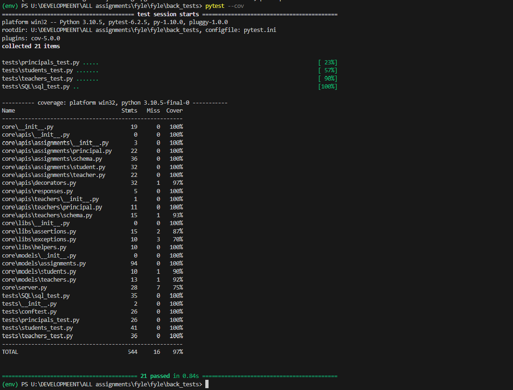

# Fyle Backend Challenge

-- Pytest and Code Coverage Report.




## Installation

1. Clone the forked repository and proceed with steps mentioned below

### USING DOCKER

1. Make sure Docker is installed and running.
2. In the root directory of project, build the docker image
```
    docker-compose build
```
3. Start the container
```
    docker-compose up
```
4. Access the Running Container and Run Database Migrations 
```
    docker ps //to get container name
    docker exec -it <container name> /bin/bash
    rm -f core/store.sqlite3
    flask db upgrade -d core/migrations/
```
5. Run pytest and see coverage report
```
    pytest -vvv -s tests/   //to run tests OR 
    pytest tests/ -vv -s --cov=core  //to run tests and see coverage
```


### USING CMD
### Install requirements

```
virtualenv env --python=python3.8
source env/bin/activate
pip install -r requirements.txt
```
### Reset DB

```
export FLASK_APP=core/server.py
rm core/store.sqlite3
flask db upgrade -d core/migrations/
```
### Start Server

```
bash run.sh
```
### Run Tests

```
pytest -vvv -s tests/

# for test coverage report
# pytest --cov
# open htmlcov/index.html
```
